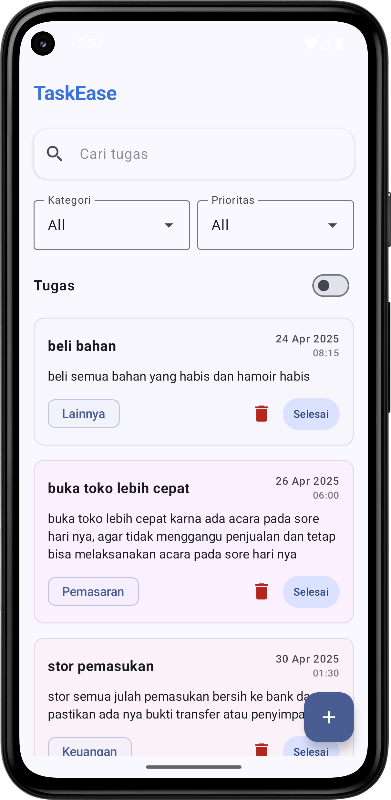
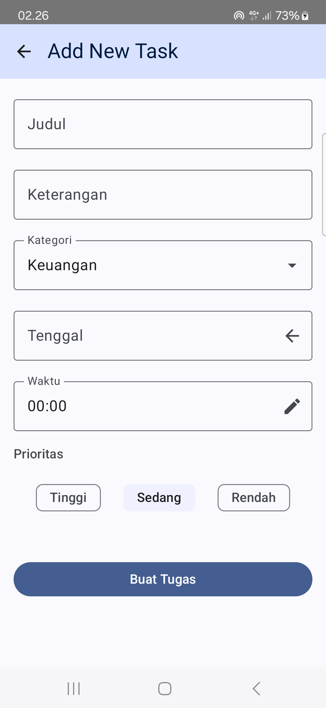
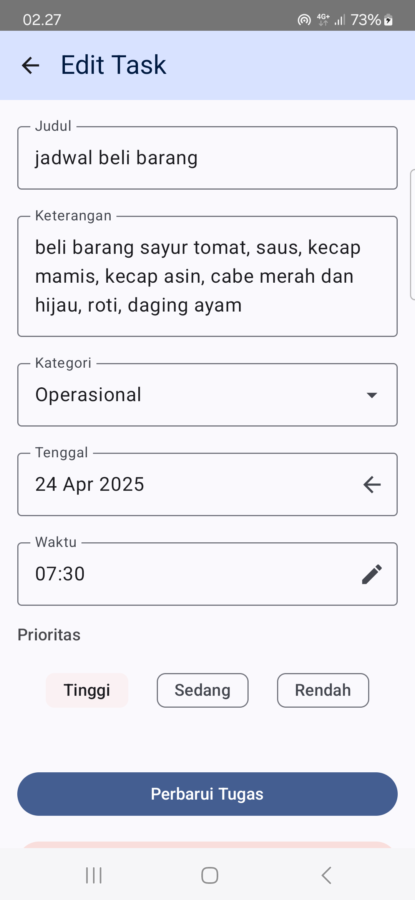
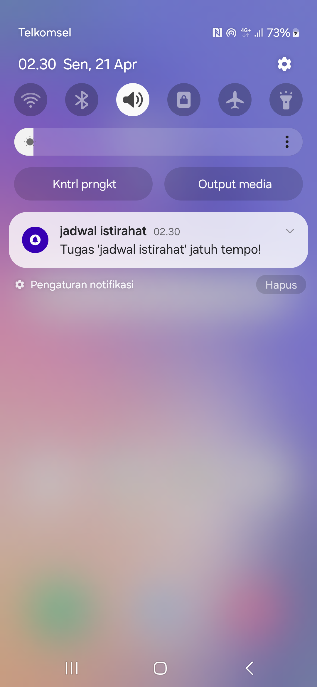

# TaskEase UMKM 📋

Aplikasi manajemen tugas berbasis Android untuk pelaku UMKM, membantu mengorganisir tugas harian
dengan fitur pengingat.

---

## 🔍 Fitur Utama

- **Tambah/Edit/Hapus Tugas**
- **Pengingat Otomatis** (Notifikasi tepat waktu)
- **Kategori Tugas** (Keuangan, Pemasaran, dll)
- **Mode Offline** (Room Database)
- **Sinkronisasi Online** (Firebase Firestore)

---

## 🛠 Teknologi

- **Bahasa**: Kotlin
- **Framework**: Jetpack Compose
- **Database**: Room (Offline), Firebase Firestore (Online)
- **Lainnya**:
    - ViewModel + Flow
    - WorkManager (Notifikasi)
    - Hilt (Dependency Injection)

---

## 🎨 Logo

  
  

---

## 📸 Screenshot Aplikasi

| Dashboard                                                      | Tambah Tugas                                          | Edit Tugas                                           | Notifikasi                                                  |
|----------------------------------------------------------------|-------------------------------------------------------|------------------------------------------------------|-------------------------------------------------------------|
|  |  |  |  |