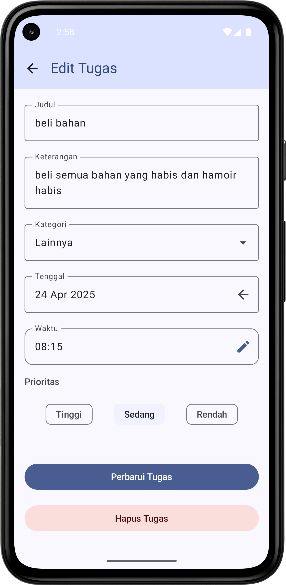

# TaskEase UMKM 📋

Aplikasi Android untuk membantu pelaku UMKM mengelola tugas harian secara efisien, dengan fitur pengingat otomatis, kategori, dan sinkronisasi online.

---

## 🔍 Fitur Utama

- ✅ **Tambah / Edit / Hapus Tugas**  
  Kelola daftar tugas secara fleksibel.
- 🔔 **Pengingat Otomatis**  
  Notifikasi tugas menjelang tenggat menggunakan AlarmManager / WorkManager.
- 📂 **Kategori Tugas**  
  Kelompokkan tugas berdasarkan jenis pekerjaan: Keuangan, Pemasaran, Operasional, dll.
- 📴 **Mode Offline (Room Database)**  
  Aplikasi tetap berjalan tanpa koneksi internet.
- ☁️ **Sinkronisasi Online (Firebase Firestore)**  
  Sinkronisasi lintas perangkat (opsional).
- 🔄 **Manajemen State**  
  ViewModel + LiveData / Flow memastikan data tetap konsisten.

---

## 🛠 Teknologi yang Digunakan

| Kebutuhan         | Teknologi                          |
|-------------------|------------------------------------|
| Bahasa            | Kotlin                             |
| UI Framework      | Jetpack Compose                    |
| Database Offline  | Room Database                      |
| Database Online   | Firebase Firestore                 |
| State Management  | ViewModel + LiveData / Flow        |
| Notifikasi        | WorkManager / AlarmManager         |
| Desain UI         | Figma / Framer                     |
| IDE               | Android Studio                     |
| Version Control   | GitHub                             |

---

## 🎯 Tujuan Proyek

Meningkatkan produktivitas pelaku UMKM yang masih bergantung pada pencatatan manual dengan menyediakan aplikasi manajemen tugas yang efisien, mudah digunakan, dan dapat digunakan secara offline maupun online.

---

## 📸 Screenshot Aplikasi

  
  
  
  

---

## 🎨 Logo

  
  

---

## 📅 Jadwal Pengembangan

- **26–30 Maret 2025**: Riset kebutuhan & desain UI
- **3–10 April 2025**: Fitur CRUD & Kategori
- **11–17 April 2025**: Notifikasi
- **18–25 April 2025**: Pengujian, finalisasi, dokumentasi

---

## ⚠️ Manajemen Risiko

- Keterlambatan → Penjadwalan ketat & evaluasi mingguan
- Bug → Pengujian unit & UI rutin
- Pengguna rendah → Promosi via komunitas UMKM
- Fitur tidak sesuai → Iterasi dari umpan balik pengguna

---

## 🧪 Evaluasi & Iterasi

- Pengujian Unit & UI
- Umpan balik langsung dari pengguna UMKM
- Analisis performa & iterasi berdasarkan kebutuhan

---

> Dibuat oleh: **Khaizul Aftar**  
> Capstone ID: **DB5-PR018 – Dicoding Bootcamp Android Developer**